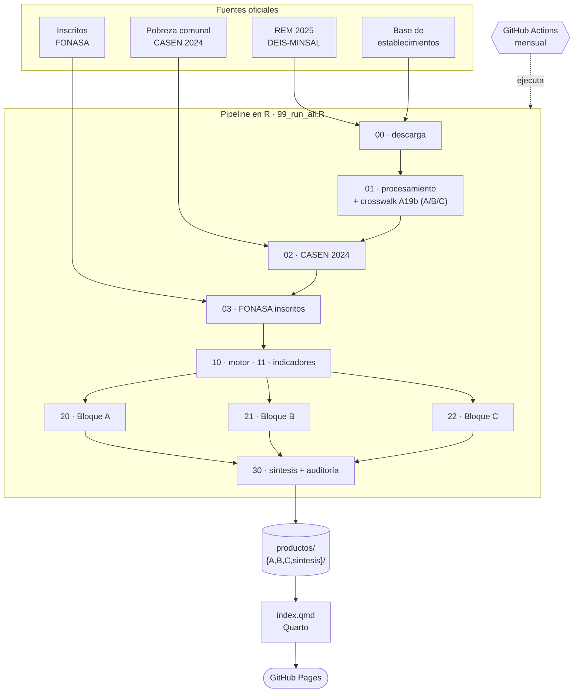

# Participación Ciudadana en Salud en Chile: análisis por secciones del REM-A19b (2025)

*Análisis estadístico reproducible de las tres familias de actividades que la red
pública de salud chilena registra en la sección REM-A19b —atención de usuarios
(OIRS), participación social y satisfacción usuaria—, con modelos por sección,
indicadores de auditoría social y un dashboard interactivo de actualización
automática.*

📊 **Dashboard en vivo:** https://arleq89.github.io/participacion-salud-rem/
· 👤 **Autor:** Javier Vera Bravo — Salud Pública, Chile ([@Arleq89](https://github.com/Arleq89))

---

## Resumen

La participación ciudadana es un derecho (Ley N.º 20.500, 2011) y un determinante
social de la salud (CSDH/OMS, 2008). Su registro operativo en Chile vive en la
sección **REM-A19b** del DEIS-MINSAL, que reúne tres familias distintas de
actividad: la atención de **Oficinas de Información, Reclamos y Sugerencias
(OIRS)**, las **actividades de participación social** (consejos, cabildos,
diálogos) y la **gestión de la satisfacción usuaria y humanización**. Estudios
previos las analizaban en bloque; aquí se analizan **sección por sección**, porque
cada una mide cosas diferentes y, como se muestra, **se comportan de forma
diferente**.

Sobre 2.982 establecimientos y 140.507 registros de 2025, mediante modelos de
barrera (*hurdle*) con efectos aleatorios, modelos multinivel de tres niveles,
autocorrelación espacial y agrupamiento, se encuentra que **registrar es un rasgo
institucional en las tres secciones** (la varianza del *establecimiento* domina:
ICC de la barrera 66–94 %), pero el peso del **territorio y de la pobreza no es
uniforme**: la **participación social** es el fenómeno más puramente institucional
(comuna ≈ 18 %, región < 1 %, sin clústeres espaciales, pobreza no significativa),
mientras que la **atención OIRS** (comuna ≈ 29 %, autocorrelación espacial
significativa) y la **satisfacción usuaria** (pobreza comunal **sí** significativa,
clústeres espaciales) tienen un componente territorial y socioeconómico real. Se
añaden indicadores de **auditoría social** con denominador poblacional (fricción
administrativa, severidad de espera, densidad democrática, cohesión intercultural).

**Palabras clave:** participación en salud · OIRS · satisfacción usuaria · datos de
conteo · modelos multinivel · autocorrelación espacial · auditoría social · Chile.

---

## 1. Introducción

La participación social en salud es a la vez un **derecho** consagrado en la
normativa chilena (Ley N.º 20.500 sobre Asociaciones y Participación Ciudadana en la
Gestión Pública, 2011) y un **determinante social de la salud** reconocido
internacionalmente (CSDH/OMS, 2008; Marmot, 2005). El Modelo de Atención Integral de
Salud Familiar y Comunitaria la sitúa como uno de sus pilares.

Operativamente, esa relación entre la red y la comunidad se registra en la sección
**REM-A19b**, que el DEIS-MINSAL organiza en tres familias de actividad. **Tratarlas
como un solo objeto oculta diferencias importantes**: un reclamo en una OIRS, una
sesión de un consejo consultivo y una medición de satisfacción usuaria responden a
lógicas distintas. Este trabajo las analiza de forma **independiente** —una unidad
analítica por sección— y luego las **compara** en una síntesis transversal.

Se abordan, para cada sección: (1) quién participa y en qué; (2) si hay patrones
espaciales; (3) cómo evoluciona en el tiempo; (4) qué factores explican las
diferencias; (5) qué revela el patrón de subregistro; (6) qué perfiles latentes
existen; y (7) qué dicen, a nivel territorial, los indicadores de auditoría social
construidos sobre un denominador poblacional.

---

## 2. Estructura del REM-A19b

El formulario A19b tiene **encabezados paraguas** (las "secciones" B y C) que no
llevan códigos propios, y **secciones-hoja** que sí registran prestaciones, cada una
con su propio layout de columnas `Col01–Col50`. El proyecto agrupa las 5
secciones-hoja en **tres bloques temáticos**:

| Bloque | Secciones-hoja | Qué mide | Códigos |
|---|---|---|---|
| **A** · OIRS | A | Reclamos, consultas, sugerencias, felicitaciones y solicitudes; gestión de plazos de respuesta | 45 |
| **B** · Participación social | B.1 + B.2 | B.1: actividades según instancia (COSOC, CDL, cabildos, indígena, jóvenes…). B.2: sesiones según línea de acción (cuentas públicas, presupuestos participativos, diálogos…) | 26 |
| **C** · Satisfacción usuaria | C.1 + C.2 | C.1: gestión de satisfacción y humanización (comités, medición SU, acompañamiento espiritual, Hospital Amigo…). C.2: sesiones según línea de acción | 22 |

Total: **93 códigos activos**. Las desagregaciones por sexo, identidad de género,
pueblos originarios, migrantes y PRAIS viven en columnas que **cambian de posición
según la sección**; se etiquetan con un *crosswalk* de columnas curado desde el
diccionario oficial (`crosswalk/crosswalk_columnas_A19b.csv`).

---

## 3. Datos y materiales

| Fuente | Contenido | Uso |
|---|---|---|
| **REM 2025 (DEIS-MINSAL)** | Producción mensual por establecimiento y prestación | Variable de actividad (sección A19b) |
| **Base maestra de establecimientos (DEIS / datos.gob.cl)** | Tipo, dependencia, nivel, coordenadas | Características del establecimiento (100 % de match) |
| **Pobreza comunal CASEN 2024 (Observatorio Social, MDSF)** | Pobreza por ingresos y multidimensional (áreas pequeñas, SAE) | Covariable de contexto comunal (345 comunas; 344/344 del REM cruzan) |
| **Población inscrita validada FONASA** | Inscritos per cápita por establecimiento/comuna | Denominador de los indicadores de auditoría social |

La unidad de registro del REM es *establecimiento × mes × prestación*. La actividad
se identifica con un *crosswalk* de 93 códigos (`crosswalk/crosswalk_participacion_A19b.csv`).
La estimación de pobreza comunal usa **estimación de áreas pequeñas** (Fay &
Herriot, 1979; Rao & Molina, 2015), que combina la CASEN con registros
administrativos. **Actualización 2026:** se migró de la CASEN 2020 (revisada 2022) a
la **CASEN 2024**, la estimación comunal más reciente (publicada en enero de 2026).

> **Nota sobre el denominador FONASA.** El portal de datos abiertos de FONASA no
> expone una URL de descarga estable, de modo que `03_fonasa_inscritos.R` lee un
> archivo de inscritos colocado en `datos/externos/`. Mientras ese archivo no esté
> presente, el pipeline usa como **proxy** la población comunal de la CASEN 2024 (los
> indicadores quedan "por 1.000 habitantes"); al incorporar el archivo FONASA, pasan
> automáticamente a "por 1.000 inscritos". Cada salida documenta el denominador usado.

---

## 4. Métodos

El mismo flujo se aplica **a cada bloque por separado** (motor `R/10_engine.R`), con
salvaguardas de convergencia: cada modelo pesado va envuelto en control de errores y,
si una sección es demasiado rala para estimarlo, se registra el motivo en
`productos/<bloque>/modelo_estado.csv` y el pipeline continúa.

### 4.1 Modelo de barrera (*hurdle*) para datos de conteo

**Pregunta:** ¿qué explica que un establecimiento *registre o no* actividad en la
sección, y *cuánta* registra?

Los conteos tienen exceso de ceros y fuerte asimetría, lo que invalida la regresión
ordinaria (Cameron & Trivedi, 2013). El modelo de barrera (Mullahy, 1986) separa el
proceso en dos:

$$
P(Y_{it}=0)=1-\pi_{it}, \qquad
P(Y_{it}=y)=\pi_{it}\,\frac{f(y;\mu_{it},\theta)}{1-f(0;\mu_{it},\theta)},\; y>0
$$

donde la parte **barrera** ($\pi_{it}$) es la probabilidad de registrar (regresión
logística) y la de **intensidad** describe cuánto se registra. La Binomial Negativa
truncada de objeto único (`glmmTMB`) **no converge** ante la cola extrema de estos
conteos; por eso se estiman las dos partes **por separado** —admisible porque la
verosimilitud del hurdle se factoriza (Mullahy, 1986)—: barrera con `glmer` logística
y intensidad con `lmer` sobre $\log(\text{conteo})$ en los positivos, ambas con
intercepto aleatorio por establecimiento (`lme4`; Bates et al., 2015).

### 4.2 Modelo multinivel de tres niveles

**Pregunta:** ¿dónde "vive" la variación —establecimiento, comuna o región— y la
pobreza comunal, la modifica?

Establecimientos anidados en comunas, y estas en regiones (Snijders & Bosker, 2012):

$$\mathrm{logit}(\pi_{ijk}) = \beta_0 + \mathbf{x}_{ijk}\boldsymbol{\beta} + u_k + v_{jk} + w_{ijk}$$

La proporción de varianza por nivel (**ICC**) se obtiene en la escala latente
sumando la varianza residual logística $\pi^2/3$ (Merlo et al., 2006). La pobreza
comunal (CASEN 2024) entra como covariable fija (efecto por cada +10 puntos).

### 4.3 Autocorrelación espacial: I de Moran y LISA

**Pregunta:** ¿las comunas vecinas se parecen (clústeres) o la cobertura se
distribuye al azar? El **I de Moran** (Moran, 1950) mide la autocorrelación global y
los **LISA** (Anselin, 1995) la descomponen localmente (`spdep`; Bivand & Wong,
2018; geometrías de `chilemapas`).

### 4.4 Agrupamiento por *k*-means (tipologías)

Por bloque, se agrupan los establecimientos según la **composición interna** de su
actividad (familias de reclamo en A; instancias en B; líneas de satisfacción en C).
En la síntesis se agrupan según la composición **entre bloques** (A/B/C), revelando
que "participar" significa cosas distintas (MacQueen, 1967).

### 4.5 Indicadores de auditoría social

Sobre un denominador poblacional (FONASA inscritos, o población CASEN como proxy):

- **I_fa — Fricción administrativa:** reclamos OIRS por cada 1.000 habitantes/inscritos.
- **T_se — Severidad de espera:** % de reclamos por tiempos de espera sobre el total de reclamos.
- **I_dd — Densidad democrática:** participantes en instancias (bloque B) por cada 100 habitantes/inscritos.
- **I_ci — Cohesión intercultural:** actividades interculturales (instancias indígenas, asistencia espiritual indígena, actividades con pueblos originarios) por cada 1.000 habitantes/inscritos.
- **Extra:** tasa de respuesta fuera de plazo, razón felicitaciones/reclamos, e inclusión migrante y de pueblos originarios per cápita.

---

## 5. Resultados por bloque

Síntesis comparativa (2025; `productos/sintesis/comparativo_bloques.csv`):

| Indicador | A · OIRS | B · Participación | C · Satisfacción |
|---|---:|---:|---:|
| Cobertura (% de establecimientos) | 49,9 % | 51,1 % | 24,4 % |
| Subregistro establecimiento-mes | 60,4 % | 71,7 % | 91,6 % |
| Mediana de meses con registro | 12 | 7 | 3 |
| % mujeres / brecha de género (pp) | 61,5 % / 23,1 | 66,5 % / 33,0 | 68,7 % / 37,5 |
| % migrantes / % pueblos originarios | 0,3 / 0,1 | 1,8 / 3,2 | 0,3 / 0,9 |
| ICC barrera (varianza del establecimiento) | 93,9 % | 65,8 % | 74,3 % |
| Varianza: establecimiento / comuna / región | 60,9 / 29,1 / 0,8 | 48,8 / 17,5 / 0,6 | 70,3 / 4,1 / 0,0 |
| Pobreza comunal (OR por +10 pp; p) | 0,59; 0,15 | 0,85; 0,26 | **0,58; <0,001** |
| Autocorrelación espacial (I de Moran; p) | **0,109; 0,001** | 0,049; 0,078 | **0,119; <0,001** |

**A · OIRS.** Es la sección de mayor volumen (17,4 millones de eventos: sobre todo
consultas y solicitudes, no solo reclamos) y la más regular (mediana de 12 meses con
registro: se reporta todos los meses). Registrar es casi enteramente institucional
(ICC 93,9 %), pero la **comuna pesa 29,1 %** y hay **autocorrelación espacial
significativa** (I = 0,109): la fricción administrativa tiene geografía. El 46,5 % de
los reclamos son por **tiempos de espera** (ver §6).

**B · Participación social.** Es el fenómeno más **puramente institucional**:
establecimiento 48,8 %, comuna 17,5 %, región 0,6 %, **sin** clústeres espaciales
(p = 0,078) y con la pobreza comunal **no** significativa. Es además el bloque con más
inclusión: 3,2 % de participación de pueblos originarios y 1,8 % de migrantes, los
más altos de las tres secciones. (Replica el hallazgo "institucional, no territorial"
de la versión global previa, que estaba dominada por esta sección.)

**C · Satisfacción usuaria.** La de **menor cobertura** (24,4 %) y **mayor
subregistro** (91,6 %; mediana de solo 3 meses con registro). Es la más concentrada
en el establecimiento (70,3 %), pero —a diferencia de A y B— la **pobreza comunal sí
es significativa** (OR 0,58 por +10 pp, p < 0,001): las comunas más pobres registran
*menos* gestión de satisfacción, y hay clústeres espaciales (I = 0,119).

**Tipologías cross-tema (k-means, k = 4).** De los ~1.880 establecimientos que
registran algo: 1.090 centrados en OIRS, 465 fuertes en participación social, 264
mixtos OIRS/participación y 61 orientados a satisfacción usuaria. "Participar"
significa cosas distintas según el establecimiento.

---

## 6. Indicadores de auditoría social

Valores nacionales 2025 (denominador: población comunal CASEN 2024 como proxy, a la
espera del archivo FONASA de inscritos; `productos/sintesis/indicadores_auditoria_*.csv`):

| Indicador | Valor nacional | Lectura |
|---|---:|---|
| **I_fa** Fricción administrativa | 11,0 reclamos / 1.000 hab. | Carga de reclamos del sistema |
| **T_se** Severidad de espera | **46,5 %** | Casi la mitad de los reclamos son por tiempos de espera |
| **I_dd** Densidad democrática | 9,1 participantes / 100 hab. | Intensidad de participación en instancias |
| **I_ci** Cohesión intercultural | 0,72 actividades / 1.000 hab. | Frecuencia de actividad con pertinencia cultural |
| Tasa de respuesta fuera de plazo | 14,7 % | Oportunidad de la respuesta OIRS |
| Razón felicitaciones / reclamos | 0,64 | Hay más reclamos que felicitaciones |

**Contrastes territoriales** (`indicadores_auditoria_region.csv`):

- **Severidad de espera (T_se):** Atacama llega al **98,9 %** (casi todos sus reclamos son por espera) y Los Lagos al 70,2 %; Aysén es el más bajo (27,3 %).
- **Respuesta fuera de plazo:** Coquimbo es el más crítico (**44,3 %**), seguido de Valparaíso (32,7 %).
- **Cohesión intercultural y pueblos originarios:** se concentran en el sur y Aysén (Araucanía: 23,7 inscritos de pueblos originarios participando por 1.000 hab.; Aysén y Los Lagos también altos).
- **Inclusión migrante:** máxima en Antofagasta (29,5 por 1.000 hab.), coherente con el norte minero.
- **Densidad democrática:** Biobío destaca muy por encima del resto (conviene revisar si refleja participación real o un patrón de registro concentrado).

> Estos indicadores cambiarán de escala (a "por 1.000 inscritos") al incorporar el
> denominador FONASA; las proporciones relativas entre territorios se mantienen.

---

## 7. Discusión

Analizar el A19b **sección por sección** matiza la conclusión de la versión global.
No es que la participación sea, sin más, "institucional y no territorial": **lo
institucional domina en las tres** (la decisión de registrar es, ante todo, un rasgo
del establecimiento y su gestión), pero el **componente territorial y socioeconómico
varía por sección**. La participación social es el caso más puro de fenómeno
institucional; la atención OIRS tiene una geografía marcada (la comuna explica casi un
tercio de la variación y hay clústeres espaciales); y la satisfacción usuaria es la
única donde la **pobreza comunal predice** —negativamente— el registro, lo que sugiere
una brecha de capacidad de gestión en las comunas más pobres justo en la dimensión
más frágil (menor cobertura y mayor subregistro). La política de fortalecimiento, por
tanto, no puede ser única: para participación social conviene intervenir
**establecimientos**; para OIRS y satisfacción, atender también el **territorio** y la
**capacidad municipal**. El predominio de los tiempos de espera entre los reclamos
(T_se ≈ 46 %) señala además un cuello de botella asistencial transversal.

---

## 8. Metodología y flujo de aprendizaje

El proyecto se construyó por fases, y varias decisiones nacieron de errores corregidos
—se documentan aquí para que el método sea trazable y reutilizable.

1. **Diagnóstico de los datos.** Las 5 series REM 2025 (Serie A ≈ 738 MB). Se
   descubrió que la **codificación real es UTF-8 con BOM, no Latin-1** como decía la
   documentación inicial: leer mal el encoding rompía los acentos y el cruce de
   códigos. Se fijó la lectura con `data.table::fread`, separador `;`, y
   `CodigoPrestacion` como texto.
2. **Crosswalk.** Los códigos del A19b (`19xxxxxx`) no calzan directo con el
   `CodigoPrestacion` del CSV; se curó un crosswalk desde el diccionario oficial,
   identificando 93 códigos activos en 5 secciones-hoja y separando los encabezados
   paraguas (B, C) de las secciones con datos.
3. **El subregistro está en las filas ausentes, no en los NA.** Se decidió **no
   colapsar NA a 0**: un establecimiento que no participa simplemente no aparece esa
   fila. Modelar exigía reconstruir el panel establecimiento × mes completo.
4. **Primer modelo y una lección de convergencia.** La Binomial Negativa truncada de
   objeto único (`glmmTMB`) **no convergió** por la cola extrema de los conteos
   (máximos de miles frente a medianas de pocas unidades). Lección incorporada al
   flujo: *verificar siempre la convergencia (NaN, errores estándar gigantes,
   dispersión ≈ 0) antes de creer un modelo*. La solución estable fue **descomponer**
   el hurdle en barrera logística + intensidad log-lineal.
5. **Efectos aleatorios.** Añadir intercepto por establecimiento (`glmer`/`lmer`)
   convergió limpio y mostró ICC altos: registrar es un rasgo estructural del
   establecimiento. De ahí al **multinivel de tres niveles** para repartir la varianza
   entre establecimiento, comuna y región, y probar la pobreza comunal.
6. **Espacial y tipologías.** I de Moran/LISA para clústeres territoriales; k-means
   para perfiles latentes de participación.
7. **Consolidación y publicación.** El pipeline exploratorio se refactorizó a una
   secuencia idempotente y parametrizable por año, con dashboard en **Quarto**,
   publicación en **GitHub Pages** y actualización mensual vía **GitHub Actions**.
   (En paralelo, *onboarding* técnico desde cero: Git/GitHub —identidad, primer
   commit, push—, la distinción entre la **consola de R** y la **Terminal**, y Quarto.)
8. **Reformulación por sección (2026).** El salto metodológico de esta versión:
   pasar de un análisis global a **un análisis por bloque** con un **motor de funciones
   reutilizable**, más una **síntesis** comparativa. Se sumaron la **CASEN 2024** (en
   reemplazo de 2020) y un **denominador poblacional FONASA** para construir
   **indicadores de auditoría social**. El resultado clave: la tesis única se matiza —
   cada sección tiene su propio equilibrio entre lo institucional y lo territorial.

---

## 9. Reproducibilidad

Requiere R (≥ 4.5) y Quarto. El pipeline va de las fuentes oficiales a un sitio web
que se reconstruye solo cada mes.



Para reproducirlo:

```r
# Paquetes (instala solo los que falten)
req <- c("here","data.table","readxl","lme4","sf","spdep","chilemapas")
faltan <- req[!sapply(req, requireNamespace, quietly = TRUE)]
if (length(faltan)) install.packages(faltan)

source("R/99_run_all.R")   # descarga, procesa y analiza todo (≈ 70 min)
```

Luego, en la terminal: `quarto render` (genera el dashboard en `docs/`). Para
completar los indicadores per cápita, coloca el archivo de inscritos FONASA en
`datos/externos/poblacion_inscrita_fonasa.csv` y vuelve a correr `03` + `30`.

```
R/
  00_descarga.R          Descarga REM + base de establecimientos
  01_procesamiento.R     Crosswalk A19b (bloques A/B/C), tabla larga, universo, cruce
  02_datos_comunales.R   Pobreza comunal CASEN 2024 (ingresos + multidimensional)
  03_fonasa_inscritos.R  Denominador poblacional FONASA (lector flexible)
  10_engine.R            Motor reutilizable de análisis por bloque
  11_indicadores.R       Indicadores de auditoría social (I_fa, T_se, I_dd, I_ci…)
  20_analisis_A.R        Bloque A · OIRS
  21_analisis_B.R        Bloque B · Participación social (B.1 + B.2)
  22_analisis_C.R        Bloque C · Satisfacción usuaria (C.1 + C.2)
  30_sintesis.R          Comparación de bloques + tipologías cross-tema + auditoría
  99_run_all.R           Script maestro
  exploratorio/          Scripts de la fase global previa (archivados)
crosswalk/  Diccionarios de códigos · productos/{A,B,C,sintesis}/  Tablas del dashboard
index.qmd   Dashboard (Quarto) · docs/  Sitio publicado · datos/  (ignorada por Git)
```

---

## 10. Limitaciones

- Se mide el **registro** de actividad, no la actividad real: un cero puede ser
  ausencia o subregistro administrativo (especialmente agudo en satisfacción usuaria).
- Diseño **observacional**: las asociaciones no implican causalidad.
- Cubre **un año (2025)**; la pobreza usa CASEN 2024 a nivel comunal (SAE).
- Los **indicadores de auditoría social** usan, por ahora, población comunal CASEN
  como denominador proxy; el denominador correcto es la **población inscrita validada
  FONASA**, que se incorpora en cuanto esté disponible el archivo.
- El bloque B combina B.1 (actividades por instancia) y B.2 (sesiones por línea de
  acción), que son unidades distintas; el modelado las trata como "eventos de
  participación" y las subsecciones se reportan por separado.

---

## 11. Conclusión

Con datos administrativos abiertos y métodos adecuados a su naturaleza, analizar el
REM-A19b sección por sección muestra que la decisión de registrar es, en las tres
familias de actividad, un rasgo **institucional** del establecimiento —pero que el
**territorio y la condición socioeconómica** pesan de manera distinta en cada una, y
de forma decisiva en la satisfacción usuaria. Los indicadores de auditoría social
traducen ese diagnóstico a métricas accionables por territorio. Es un insumo para
focalizar el fortalecimiento de la participación y un ejemplo de análisis reproducible
y publicado de forma automatizada sobre fuentes oficiales.

---

## Referencias

- Anselin, L. (1995). Local Indicators of Spatial Association—LISA. *Geographical Analysis*, 27(2), 93–115.
- Bates, D., Mächler, M., Bolker, B., & Walker, S. (2015). Fitting linear mixed-effects models using lme4. *Journal of Statistical Software*, 67(1), 1–48.
- Bivand, R. S., & Wong, D. W. S. (2018). Comparing implementations of global and local indicators of spatial association. *TEST*, 27(3), 716–748.
- Cameron, A. C., & Trivedi, P. K. (2013). *Regression Analysis of Count Data* (2.ª ed.). Cambridge University Press.
- Comisión sobre Determinantes Sociales de la Salud (CSDH/OMS). (2008). *Subsanar las desigualdades en una generación*. OMS.
- Fay, R. E., & Herriot, R. A. (1979). Estimates of income for small places. *JASA*, 74(366), 269–277.
- Gelman, A., & Hill, J. (2007). *Data Analysis Using Regression and Multilevel/Hierarchical Models*. Cambridge University Press.
- Marmot, M. (2005). Social determinants of health inequalities. *The Lancet*, 365(9464), 1099–1104.
- Merlo, J., Chaix, B., Ohlsson, H., et al. (2006). A brief conceptual tutorial of multilevel analysis in social epidemiology. *J. Epidemiol. Community Health*, 60(4), 290–297.
- Moran, P. A. P. (1950). Notes on continuous stochastic phenomena. *Biometrika*, 37(1/2), 17–23.
- Mullahy, J. (1986). Specification and testing of some modified count data models. *Journal of Econometrics*, 33(3), 341–365.
- MacQueen, J. (1967). Some methods for classification and analysis of multivariate observations. *Proc. 5th Berkeley Symposium*, 1, 281–297.
- Ministerio de Desarrollo Social y Familia. (2026). *Estimaciones de Pobreza Comunal CASEN 2024 (SAE)*. Observatorio Social.
- Rao, J. N. K., & Molina, I. (2015). *Small Area Estimation* (2.ª ed.). Wiley.
- Snijders, T. A. B., & Bosker, R. J. (2012). *Multilevel Analysis* (2.ª ed.). Sage.

*Datos oficiales del DEIS (MINSAL), MDSF y FONASA. Documento técnico que acompaña al
repositorio; no constituye una publicación revisada por pares.*
