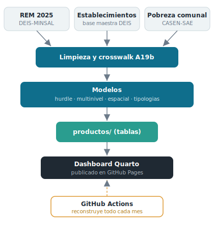

```{r}
#| label: setup
#| include: false
library(data.table)
library(ggplot2)

interactivo <- function(g) {
  if (requireNamespace("plotly", quietly = TRUE))
    plotly::ggplotly(g, tooltip = "text")
  else g
}

# ---- Productos del pipeline (las tablas que alimentan el tablero) -----------
kpi    <- fread("productos/kpis_generales.csv", sep = ";")
cobreg <- fread("productos/cobertura_region.csv", sep = ";")
serie  <- fread("productos/serie_mensual.csv", sep = ";")
mreg   <- fread("productos/modelo_region.csv", sep = ";")
micc   <- fread("productos/modelo_icc.csv", sep = ";")
eqreg  <- fread("productos/equidad_region.csv", sep = ";")
eqkpi  <- fread("productos/equidad_kpis.csv", sep = ";")
inst   <- fread("productos/instancias.csv", sep = ";")
gen    <- fread("productos/genero.csv", sep = ";")
recl   <- fread("productos/reclamos_region.csv", sep = ";")
cobtipo<- fread("productos/cobertura_tipo.csv", sep = ";")
mvar   <- fread("productos/modelo_multinivel_var.csv", sep = ";")
det    <- fread("productos/modelo_determinantes.csv", sep = ";")
covsp  <- fread("productos/cobertura_vs_pobreza.csv", sep = ";")
moran  <- fread("productos/moran_global.csv", sep = ";")
lisa   <- fread("productos/lisa_comuna.csv", sep = ";")
tperf  <- fread("productos/tipologias_perfil.csv", sep = ";")
temas  <- fread("productos/temas.csv", sep = ";")
# Nuevos cruces de la reformulación
txtema <- fread("productos/tipo_x_tema.csv", sep = ";")
txinst <- fread("productos/tipo_x_instancia.csv", sep = ";")
rxtipo <- fread("productos/region_x_tipo.csv", sep = ";")
rxperf <- fread("productos/region_x_perfil.csv", sep = ";")
mtema  <- fread("productos/moran_por_tema.csv", sep = ";")
sexo   <- fread("productos/sexo.csv", sep = ";")
mserv  <- fread("productos/espacial_servicio.csv", sep = ";")
skpi   <- fread("productos/social_kpis.csv", sep = ";")
sinst  <- fread("productos/social_instancias.csv", sep = ";")
sequ   <- fread("productos/social_equidad.csv", sep = ";")
gsk <- function(n) skpi[indicador == n, valor]
gse <- function(n) sequ[indicador == n, valor]

getd <- function(n) det[indicador == n, valor]
gm   <- function(n) moran[indicador == n, valor]
getk <- function(n) kpi[indicador == n, valor]
gete <- function(n) eqkpi[indicador == n, valor]
getct<- function(t) cobtipo[tipo_grp == t, pct]

# Etiqueta corta de tema para heatmaps y barras.
recode_tema <- function(x) fcase(
  x == "OIRS / Reclamos y solicitudes", "OIRS / Reclamos",
  x == "Participación social", "Participación social",
  x == "Satisfacción usuaria y humanización", "Satisfacción",
  default = x)
txtema[, tema_c := recode_tema(tema)]
temas[,  tema_c := recode_tema(tema)]

# Nombres de región.
reg_nom <- data.table(
  IdRegion = c(15,1,2,3,4,5,13,6,7,16,8,9,14,10,11,12),
  region   = c("Arica y Parinacota","Tarapacá","Antofagasta","Atacama",
               "Coquimbo","Valparaíso","Metropolitana","O'Higgins","Maule",
               "Ñuble","Biobío","La Araucanía","Los Ríos","Los Lagos",
               "Aysén","Magallanes"))
pr <- function(dt) merge(dt, reg_nom, by = "IdRegion", all.x = TRUE)
cobreg <- pr(cobreg); eqreg <- pr(eqreg); recl <- pr(recl); mreg <- pr(mreg)
rxtipo <- pr(rxtipo); rxperf <- pr(rxperf)

gen[, etiqueta := fifelse(grepl("binarie", etiqueta, ignore.case = TRUE),
                          "No binarie", etiqueta)]
gen <- gen[, .(personas = sum(personas)), by = etiqueta][order(-personas)]

# Tabla consolidada por región (pestaña Territorial).
tab_reg <- Reduce(function(a,b) merge(a,b,by="IdRegion",all=TRUE),
  list(cobreg[,.(IdRegion,region,cobertura=pct)],
       eqreg[,.(IdRegion,pct_pueblos_originarios,pct_migrantes)],
       recl[,.(IdRegion,pct_fuera_plazo)],
       mreg[,.(IdRegion,prob_modelo=round(100*prob_registra,1))]))
tab_reg <- tab_reg[order(-cobertura),
  .(Región=region, `Cobertura %`=cobertura,
    `% Pueblos Orig.`=pct_pueblos_originarios, `% Migrantes`=pct_migrantes,
    `% Reclamos fuera plazo`=pct_fuera_plazo, `Prob. modelo %`=prob_modelo)]

# Perfiles de registro: fusiona los dos clústeres "reclamos" en uno.
rxperf[, grupo := fifelse(perfil %in% c(2,3), "Reclamos (OIRS)", etiqueta)]
rxp <- rxperf[, .(n = sum(n_estab)), by = .(IdRegion, region, grupo)]
rxp[, pct := round(100 * n / sum(n), 1), by = IdRegion]

tg <- theme_minimal(base_size = 12) + theme(plot.title = element_blank())

# --- vb(): value box con subtítulo visible + tooltip explicativo -------------
vb <- function(valor, sub, def, icon = "info-circle", color = "primary",
               title = NULL) {
  if (requireNamespace("bslib", quietly = TRUE)) {
    bslib::value_box(
      title    = title,
      value    = valor,
      htmltools::tags$span(
        sub, title = def,
        style = paste0("font-size:.78rem; font-weight:400; line-height:1.25; ",
                       "opacity:.92; cursor:help")),
      showcase = htmltools::HTML(sprintf('<i class="bi bi-%s"></i>', icon)),
      theme    = color)
  } else {
    list(value = valor, title = title, icon = icon, color = color)
  }
}

# --- Glosario (fuente única de verdad para los tooltips) ---------------------
glosario <- data.table(
  Termino = c(
    "Cobertura", "Subregistro", "Participación (REM-A19b)", "OIRS",
    "Participación social", "Satisfacción usuaria", "REM", "DEIS",
    "Establecimiento", "CESFAM", "Posta de Salud Rural (PSR)",
    "SAPU / SUR", "Dependencia administrativa",
    "Odds Ratio (OR)", "p-valor", "ICC",
    "Modelo de barrera (hurdle)", "Modelo multinivel",
    "I de Moran", "LISA", "k-means (tipologías)", "CASEN-SAE",
    "Norma General de Participación", "Cuenta Pública Participativa (CPP)",
    "Consejo de Desarrollo Local (CDL)", "CIRA"),
  Definicion = c(
    "Porcentaje de establecimientos de la red pública que registró al menos una actividad de participación durante el año. Mide si hubo registro, no cuánto ni con qué calidad.",
    "De todas las combinaciones de establecimiento y mes en que se esperaba un registro, el porcentaje que no tiene ninguno. Un valor sin registro puede deberse a ausencia real de actividad o a omisión administrativa; el dato no permite distinguir ambos casos.",
    "Sección del REM que consolida las actividades de participación ciudadana en salud, agrupadas en tres temas: OIRS, participación social y satisfacción usuaria (93 códigos de prestación activos).",
    "Oficinas de Información, Reclamos y Sugerencias: el canal formal por el que la ciudadanía presenta reclamos, consultas o felicitaciones a un establecimiento de salud.",
    "Instancias de incidencia de la comunidad en la gestión sanitaria: consejos de desarrollo, cabildos, diálogos ciudadanos y mecanismos similares.",
    "Actividades de medición y gestión de la experiencia de las personas usuarias del sistema de salud (encuestas, buzones, etc.).",
    "Resúmenes Estadísticos Mensuales: el sistema oficial con que cada establecimiento reporta su producción mensual al MINSAL.",
    "Departamento de Estadísticas e Información de Salud del Ministerio de Salud; publica los REM como datos abiertos.",
    "Unidad básica de la red asistencial (hospital, CESFAM, posta, etc.). En este análisis es el nivel donde se concentra la mayor parte de la variación.",
    "Centro de Salud Familiar: establecimiento de atención primaria que atiende a una población a cargo bajo el modelo de salud familiar y comunitaria.",
    "Establecimiento pequeño de atención primaria en zonas rurales, con dotación reducida y apoyo de rondas médicas.",
    "Servicio de Atención Primaria de Urgencia (SAPU) y Servicio de Urgencia Rural (SUR): atención de urgencia de baja complejidad. Registran poca participación por el diseño de su función.",
    "Entidad de la que depende administrativamente el establecimiento (municipal, servicio de salud, etc.).",
    "Medida de asociación: cuántas veces más (o menos) probable es un resultado al cambiar un factor. OR=1 indica que el factor no cambia la probabilidad; mayor que 1 la aumenta, menor que 1 la reduce.",
    "Probabilidad de observar un resultado al menos tan extremo como el obtenido si el factor en realidad no tuviera efecto. Por convención, valores bajo 0,05 se consideran estadísticamente significativos.",
    "Coeficiente de Correlación Intraclase: del total de la variación en participación, el porcentaje atribuible a un nivel (establecimiento, comuna o región) en contraste con los demás.",
    "Modelo para datos de conteo con muchos ceros que separa dos preguntas: primero si un establecimiento registra o no participación, y luego, si registra, cuánta.",
    "Modelo que reconoce que los establecimientos están anidados en comunas y estas en regiones, y reparte la variación entre esos niveles sin subestimar el error.",
    "Indicador de autocorrelación espacial global: mide si comunas vecinas tienen niveles de participación parecidos. Cercano a cero y no significativo indica distribución espacial sin patrón.",
    "Local Indicators of Spatial Association: versión local del I de Moran que identifica, comuna por comuna, focos de valores altos o bajos rodeados de vecinos similares.",
    "Método que agrupa establecimientos según la composición de su participación entre los tres temas, formando perfiles internamente parecidos y distintos entre sí.",
    "Estimación de pobreza comunal por metodología de áreas pequeñas, que combina la encuesta CASEN con registros administrativos para producir cifras a nivel de comuna.",
    "Norma del MINSAL (Res. 31/2015, bajo la Ley 20.500) que fija los mecanismos de participación ciudadana en la gestión pública de salud: cuenta pública participativa, COSOC, consulta ciudadana, consejos de desarrollo y consultivos, entre otros.",
    "Mecanismo en que usuarios, funcionarios y dirección acuerdan y rinden la cuenta anual de la gestión del establecimiento, para el control social de la salud pública. No se registra directamente en la A19b.",
    "Instancia de control social y participación de la población usuaria en el desarrollo institucional de los establecimientos de atención primaria y hospitales de menor complejidad.",
    "Consejo de Integración de la Red Asistencial: instancia de coordinación y participación a nivel de servicio de salud."),
  Simple = c(
    "De cada 100 establecimientos, cuántos anotaron alguna actividad de participación en el año.",
    "Cuántos registros mensuales que deberían existir aparecen sin ningún dato.",
    "La parte del formulario REM donde se anota la participación ciudadana en salud.",
    "La ventanilla donde reclamas, consultas o felicitas a tu centro de salud.",
    "Cuando vecinos y organizaciones participan en cómo se gestiona la salud local.",
    "Preguntarle a las personas cómo les fue en su atención y actuar sobre eso.",
    "El informe mensual que cada centro de salud envía con todo lo que hizo.",
    "La oficina del MINSAL que junta y publica esas estadísticas.",
    "Cada centro de salud concreto: un hospital, un CESFAM, una posta.",
    "El centro de salud del barrio que atiende a las familias del sector.",
    "El pequeño centro de salud del campo, con menos personal.",
    "Los servicios de urgencia; por su función casi no registran participación.",
    "Quién manda administrativamente sobre el establecimiento (el municipio, el servicio de salud).",
    "Cuánto más o menos probable se vuelve algo cuando cambia un factor.",
    "Qué tan probable es que el resultado sea pura casualidad; si es muy bajo, no lo es.",
    "Qué parte de las diferencias viene del establecimiento, de la comuna o de la región.",
    "Primero pregunta '¿registró o no?' y solo después '¿cuánto?'.",
    "Tiene en cuenta que los centros están dentro de comunas y las comunas dentro de regiones.",
    "Revisa si las comunas vecinas se parecen en participación o si están repartidas al azar.",
    "Señala en el mapa los focos donde varias comunas vecinas comparten valores altos o bajos.",
    "Ordena los establecimientos en grupos según el tipo de participación que hacen.",
    "Una forma de estimar la pobreza de cada comuna combinando la encuesta CASEN con registros.",
    "El reglamento que dice cómo debe participar la ciudadanía en la salud pública.",
    "La reunión anual donde el centro de salud rinde cuentas a su comunidad.",
    "El consejo donde vecinos y dirigentes inciden en la gestión del centro de salud.",
    "La mesa donde se coordina y participa a nivel de toda la red de un servicio de salud."))

def_de <- function(t) {
  d <- glosario[Termino == t, Definicion]
  if (length(d)) d[1] else ""
}
```

# Resumen

## Row {height="15%"}

::: {.card .hero}
::: {.hero-box}
[Participación ciudadana en salud · REM Chile 2025]{.hero-kicker}

[La participación que el sistema registra es un fenómeno **institucional** —del establecimiento y su gestión local—, **no territorial ni socioeconómico**. Y lo que más se mide (el reclamo) no es lo que la norma prioriza (la deliberación).]{.hero-thesis}
:::
:::

## Row {height="21%"}

```{r}
vb(paste0(getk("pct_cobertura"), "%"),
   "% de establecimientos que registró ≥1 actividad en 2025",
   def_de("Cobertura"),
   icon = "people-fill", color = "primary", title = "Cobertura nacional")
```

```{r}
vb(format(getk("establecimientos_participan"), big.mark = "."),
   "establecimientos con al menos un registro en el año",
   "Número de establecimientos de la red pública que registró al menos una actividad de participación durante 2025 (el numerador de la cobertura nacional).",
   icon = "hospital", color = "info", title = "Establecimientos que participan")
```

```{r}
vb(getk("prestaciones_monitoreadas"),
   "códigos de prestación de participación (sección A19b)",
   def_de("Participación (REM-A19b)"),
   icon = "list-check", color = "secondary", title = "Prestaciones monitoreadas")
```

```{r}
vb(paste0(getk("pct_subregistro_estab_mes"), "%"),
   "% de combinaciones establecimiento-mes sin ningún registro",
   def_de("Subregistro"),
   icon = "exclamation-triangle", color = "warning", title = "Subregistro (estab-mes)")
```

## Row {height="64%"}

```{r}
#| title: "Actividades de participación registradas por mes y tema"
serie[, Mes := as.integer(Mes)]
g <- ggplot(serie, aes(x = Mes, y = actividades, color = tema, group = tema,
                       text = paste0(tema, " · mes ", Mes, ": ",
                                     format(actividades, big.mark=".")))) +
  geom_line(linewidth = 1) + geom_point(size = 1.5) +
  scale_x_continuous(breaks = 1:12) +
  labs(x = "Mes", y = "Actividades", color = "Tema") +
  tg + theme(legend.position = "bottom")
interactivo(g)
```

::: {.card title="La tesis en una línea"}
La red pública registró participación ciudadana en el sistema REM 2025 a través de
tres familias: reclamos (OIRS), participación social (consejos, cabildos) y
satisfacción usuaria. El **63% de los establecimientos** registró algo, pero con un
**53,8% de subregistro** establecimiento-mes. Las pestañas recorren cuatro actos:
qué manda la **norma**, qué se **registra** (quién y qué), qué **brechas** quedan, y
qué lo **explica**.
:::

# Norma vs. registro

## Row {height="42%"}

### Column {width="58%"}

```{r}
#| title: "Volumen registrado por tema (la deliberación casi no se mide)"
g <- ggplot(temas, aes(x = reorder(tema_c, actividades), y = actividades,
       text = paste0(tema_c, ": ", format(actividades, big.mark="."),
                     " actividades · ", establecimientos, " establecimientos"))) +
  geom_col(fill = "#0f6e8c") + coord_flip() +
  scale_y_continuous(labels = function(x) format(x, big.mark=".", scientific=FALSE)) +
  labs(x = NULL, y = "Actividades registradas (2025)") + tg
interactivo(g)
```

### Column {width="42%"}

::: {.card title="Qué dice la norma"}
La **Norma General de Participación Ciudadana en la Gestión Pública de Salud**
(Res. 31/2015, Ley 20.500) define la participación como *"la capacidad de incidir en
las decisiones"* y fija mecanismos formales: cuenta pública participativa, COSOC,
consulta ciudadana, consejos de desarrollo y consultivos, CIRA. El núcleo del
derecho es la **deliberación**. Sin embargo, el volumen registrado está dominado por
el **reclamo** (OIRS): la deliberación, aunque presente en muchos establecimientos,
casi no se mide.
:::

## Row {height="38%"}

```{r}
#| title: "Mecanismos de la norma y su correlato en el registro REM"
mapa_norma <- data.table(
  `Mecanismo (Norma General)` = c(
    "Cuenta pública participativa", "COSOC", "Consejo de Desarrollo Local (CDL)",
    "Consejos Consultivos de Usuarios", "CIRA",
    "Cabildos / consulta ciudadana", "OIRS (reclamos)",
    "Satisfacción usuaria"),
  `¿Se registra en A19b?` = c(
    "Indirecto", "Sí", "Sí", "Sí", "Sí", "Sí", "Sí", "Sí"),
  `Dónde en el REM` = c(
    "— (rendición de cuentas)", "Participación social", "Participación social",
    "Participación social", "Participación social", "Participación social",
    "OIRS / Reclamos", "Satisfacción usuaria"))
if (requireNamespace("DT", quietly = TRUE)) {
  DT::datatable(mapa_norma, rownames = FALSE,
    options = list(dom = "t", ordering = FALSE), class = "stripe compact")
} else knitr::kable(mapa_norma)
```

## Row {height="20%"}

::: {.card title="El subregistro está habilitado por diseño"}
El manual REM, para la sección de participación social, indica textualmente que
*"esta sección no presenta regla de consistencia"*: el instrumento **no valida** ese
registro. Por eso el subregistro (53,8%) no es solo negligencia, sino una
consecuencia del diseño del propio formulario, **accionable desde el nivel central**.
:::

# Quién hace qué

## Row {height="50%"}

### Column

```{r}
#| title: "Cobertura: % de cada tipo que registra cada tema"
g <- ggplot(txtema, aes(x = tema_c, y = reorder(tipo_grp, pct_estab),
       fill = pct_estab,
       text = paste0(tipo_grp, " · ", tema_c, ": ", pct_estab, "% de cobertura"))) +
  geom_tile(color = "white", linewidth = 0.4) +
  scale_fill_viridis_c(name = "% estab.", option = "D") +
  labs(x = NULL, y = NULL) +
  tg + theme(axis.text.x = element_text(angle = 12, hjust = 1))
interactivo(g)
```

### Column

```{r}
#| title: "Composición: del volumen de cada tipo, cuánto va a cada tema"
g <- ggplot(txtema, aes(x = tema_c, y = reorder(tipo_grp, pct_estab),
       fill = pct_volumen_tipo,
       text = paste0(tipo_grp, " · ", tema_c, ": ", pct_volumen_tipo,
                     "% del volumen del tipo"))) +
  geom_tile(color = "white", linewidth = 0.4) +
  scale_fill_distiller(name = "% volumen", palette = "YlOrBr", direction = 1) +
  labs(x = NULL, y = NULL) +
  tg + theme(axis.text.x = element_text(angle = 12, hjust = 1))
interactivo(g)
```

## Row {height="30%"}

::: {.card title="Cómo leer esta sección"}
Las dos caras del mismo dato. Por **cobertura** (izquierda), la participación social
está muy extendida: la registran el 94% de los CESFAM, el 74% de los CECOSF y el 47%
de las postas rurales. Pero por **composición del volumen** (derecha), casi todo es
**reclamo** (OIRS): en hospitales el 98,6% del volumen, en CESFAM el 97,5%. Es decir:
*muchos establecimientos hacen participación social, pero en volúmenes mínimos frente
a la masa de reclamos*. Los servicios de urgencia (SAPU, SUR) casi no registran nada,
por el diseño de su función.
:::

# Participación social

## Row {height="20%"}

```{r}
vb(paste0(gsk("cobertura_social_pct"), "%"),
   "% de establecimientos que registra participación social",
   "Cobertura de participación social: porcentaje de establecimientos de la red que registró al menos una actividad de participación social (consejos, cabildos, instancias) durante el año.",
   icon = "people", color = "primary", title = "Cobertura social")
```

```{r}
vb(format(gsk("establecimientos_social"), big.mark = "."),
   "establecimientos con ≥1 actividad de participación social",
   "Número de establecimientos que registró al menos una actividad de participación social en el año.",
   icon = "hospital", color = "info", title = "Establecimientos")
```

```{r}
vb(format(gsk("intensidad_social"), big.mark = "."),
   "actividades por establecimiento que participa",
   "Intensidad: promedio de actividades de participación social por establecimiento que la registra. Mide cuánto, no cuántos.",
   icon = "graph-up", color = "secondary", title = "Intensidad")
```

```{r}
vb(paste0(gse("pct_mujeres"), "%"),
   "de las personas participantes son mujeres",
   "Composición por sexo de quienes participan en actividades de participación social: predominio femenino marcado.",
   icon = "gender-female", color = "success", title = "Mujeres")
```

## Row {height="45%"}

### Column

```{r}
#| title: "Cobertura por tipología (% de establecimientos que la realiza)"
g <- ggplot(sinst, aes(x = reorder(etiqueta, cobertura), y = cobertura,
       text = paste0(etiqueta, ": ", cobertura, "% de cobertura"))) +
  geom_col(fill = "#2a9d8f") + coord_flip() +
  labs(x = NULL, y = "% de establecimientos") + tg
interactivo(g)
```

### Column

```{r}
#| title: "Intensidad por tipología (actividades por establecimiento)"
g <- ggplot(sinst, aes(x = reorder(etiqueta, intensidad), y = intensidad,
       text = paste0(etiqueta, ": ", intensidad, " actividades por establecimiento"))) +
  geom_col(fill = "#e09f3e") + coord_flip() +
  labs(x = NULL, y = "Actividades por establecimiento") + tg
interactivo(g)
```

## Row {height="35%"}

### Column {width="45%"}

```{r}
#| title: "Inclusión dentro de la participación social (%)"
incl <- data.table(
  grupo = c("Mujeres", "Hombres", "Pueblos originarios", "Migrantes"),
  pct   = c(gse("pct_mujeres"), gse("pct_hombres"),
            gse("pct_pueblos_originarios"), gse("pct_migrantes")))
g <- ggplot(incl, aes(x = reorder(grupo, pct), y = pct,
       text = paste0(grupo, ": ", pct, "%"))) +
  geom_col(fill = "#756bb1") + coord_flip() +
  labs(x = NULL, y = "% de participantes") + tg
interactivo(g)
```

### Column {width="55%"}

::: {.card title="Lectura: el núcleo deliberativo que prioriza la norma"}
La participación social es lo que la **Norma General** entiende por participación en
sentido pleno —incidir en las decisiones—, pero solo la registra el
**`r gsk("cobertura_social_pct")`%** de los establecimientos. Tres señales: (1) la
tipología más grande son las **"Otras Instancias" sin clasificar**, lo que indica que
el formulario no captura bien *qué* instancia ocurre; (2) las formas más deliberativas
y territoriales —**cabildos**, COSOC— están entre las **menos registradas**;
(3) participan cerca de **dos mujeres por cada hombre** (`r gse("pct_mujeres")`%
mujeres). *Nota de dato:* el REM reporta las instancias y la demografía de participantes
por separado, así que **no es posible cruzar instancia × perfil de participante**.
:::

# Territorial

## Row {height="54%"}

```{r}
#| title: "Mapa de establecimientos · filtra por región, tipo y tipo de actividad"
res_mapa <- tryCatch({
  stopifnot(requireNamespace("leaflet", quietly = TRUE),
            requireNamespace("crosstalk", quietly = TRUE))
  mapd <- fread("productos/mapa_establecimientos.csv", sep = ";")
  mapd <- mapd[!is.na(Latitud) & !is.na(Longitud)]
  # Radio del punto = actividad (raíz para domar la cola larga); mínimo visible.
  mapd[, radio := scales::rescale(sqrt(actividades + 1), to = c(3, 16))]
  # Paleta propia: colores fuertes y visibles sobre el mapa claro
  # (Posta Rural en naranja y SUR en café, antes casi invisibles en amarillo).
  tipos_lv <- c("Hospital","CESFAM","CECOSF","Posta Rural (PSR)","COSAM",
                "SAR","SAPU","SUR","Otro")
  tipos_col <- c("#b2182b","#1f78b4","#33a02c","#e6550d","#6a3d9a",
                 "#00897b","#e7298a","#8c510a","#7f7f7f")
  pal <- leaflet::colorFactor(palette = tipos_col, levels = tipos_lv,
                              na.color = "#b0b0b0")
  sd  <- crosstalk::SharedData$new(mapd)
  filtros <- htmltools::tagList(
    crosstalk::filter_select("reg",  "Región", sd, ~region),
    crosstalk::filter_select("tipo", "Tipo de establecimiento", sd, ~tipo_grp),
    crosstalk::filter_select("tema", "Tipo de actividad", sd, ~tema),
    crosstalk::filter_select("nom",  "Buscar establecimiento por nombre", sd, ~nombre))
  mapa_lf <- leaflet::leaflet(sd, height = 560, width = "100%") |>
    leaflet::addProviderTiles("CartoDB.Positron") |>
    leaflet::fitBounds(-76, -56, -66, -17) |>   # encuadre en Chile continental
    leaflet::addCircleMarkers(
      lng = ~Longitud, lat = ~Latitud, radius = ~radio,
      color = ~pal(tipo_grp), stroke = FALSE, fillOpacity = 0.75,
      popup = ~paste0("<b>", nombre, "</b><br>", tipo_grp, " · ", ComunaGlosa,
                      "<br>", tema, ": ", format(actividades, big.mark = "."),
                      " actividades (", activo, ")")) |>
    leaflet::addLegend("bottomright", pal = pal, values = ~tipo_grp,
                       title = "Tipo de establecimiento", opacity = 0.9)
  # Filtros a la IZQUIERDA (angostos) y mapa a la DERECHA (ancho), con flexbox.
  htmltools::div(
    style = "display:flex; gap:1rem; align-items:stretch;",
    htmltools::div(style = "flex:0 0 240px; max-width:240px;", filtros),
    htmltools::div(style = "flex:1 1 auto; min-width:0;", mapa_lf))
}, error = function(e)
  htmltools::HTML(paste0(
    "<div style='padding:1rem'>Para el mapa interactivo: corre ",
    "<code>R/09_mapa_establecimientos.R</code> e instala los paquetes ",
    "<code>leaflet</code> y <code>crosstalk</code>.<br><small>Detalle: ",
    conditionMessage(e), "</small></div>")))
res_mapa
```

## Row {height="30%"}

### Column

```{r}
#| title: "Perfil de registro por región (cada barra suma 100%)"
g <- ggplot(rxp, aes(x = reorder(region, pct * (grupo == "Fuerte en participación social")),
       y = pct, fill = grupo,
       text = paste0(region, " · ", grupo, ": ", round(pct), "%"))) +
  geom_col() + coord_flip() +
  scale_fill_manual(values = c("Fuerte en participación social" = "#2a9d8f",
                               "Reclamos (OIRS)" = "#0f6e8c",
                               "Orientado a satisfacción usuaria" = "#e09f3e"),
                    name = NULL) +
  labs(x = NULL, y = "% de establecimientos de la región") +
  tg + theme(legend.position = "bottom")
interactivo(g)
```

### Column

```{r}
#| title: "Composición de la red por región (tipo de establecimiento, %)"
g <- ggplot(rxtipo, aes(x = region, y = pct_region, fill = tipo_grp,
       text = paste0(region, " · ", tipo_grp, ": ", pct_region, "%"))) +
  geom_col() + coord_flip() +
  scale_fill_brewer(palette = "Set3", name = NULL) +
  labs(x = NULL, y = "% de establecimientos de la región") +
  tg + theme(legend.position = "right")
interactivo(g)
```

## Row {height="16%"}

::: {.card title="Cómo leer esta sección"}
El mapa localiza cada establecimiento (color = tipo, tamaño = actividad). El cruce
con las **tipologías** explica los contrastes: por **perfil de registro**, la región
que más delibera es
`r {x <- rxp[grupo=="Fuerte en participación social"][which.max(pct)]; paste0(x$region, " (", x$pct, "%)")}`,
y la más centrada en **reclamos** es
`r {x <- rxp[grupo=="Reclamos (OIRS)"][which.max(pct)]; paste0(x$region, " (", x$pct, "%)")}`.
Buena parte de las diferencias regionales es **composición** de tipos, no un "efecto
región": el modelo le atribuye solo `r mvar[nivel=="Región", pct_varianza]`% de la
variación.
:::

# Brechas: subregistro, dato y equidad

## Row {height="20%"}

```{r}
#| content: valuebox
#| title: "Subregistro (establecimiento-mes)"
#| icon: exclamation-triangle
#| color: warning
list(value = paste0(getk("pct_subregistro_estab_mes"), "%"))
```

```{r}
#| content: valuebox
#| title: "Pueblos originarios (participantes)"
#| icon: globe-americas
#| color: success
list(value = paste0(gete("pct_pueblos_originarios"), "%"))
```

```{r}
#| content: valuebox
#| title: "Migrantes (participantes)"
#| icon: signpost-split
#| color: info
list(value = paste0(gete("pct_migrantes"), "%"))
```

## Row {height="42%"}

### Column

```{r}
#| title: "Participación de pueblos originarios por región (%)"
g <- ggplot(eqreg, aes(x = reorder(region, pct_pueblos_originarios),
       y = pct_pueblos_originarios,
       text = paste0(region, ": ", pct_pueblos_originarios, "%"))) +
  geom_col(fill = "#238b45") + coord_flip() +
  labs(x = NULL, y = "% de participantes de pueblos originarios") + tg
interactivo(g)
```

### Column

```{r}
#| title: "Reclamos respondidos FUERA del plazo legal, por región (%)"
g <- ggplot(recl, aes(x = reorder(region, pct_fuera_plazo), y = pct_fuera_plazo,
       text = paste0(region, ": ", pct_fuera_plazo, "%"))) +
  geom_col(fill = "#de2d26") + coord_flip() +
  labs(x = NULL, y = "% de reclamos respondidos fuera de plazo") + tg
interactivo(g)
```

## Row {height="38%"}

### Column

```{r}
#| title: "Participación registrada por género"
# Sexo (Hombres/Mujeres) y diversidad de género (trans/no binarie) en paneles
# separados: la diversidad es minoritaria y con escala propia se hace visible.
s1 <- copy(sexo)[, grupo := "Sexo"]
s2 <- gen[!grepl("revelado", etiqueta, ignore.case = TRUE),
          .(etiqueta, personas)][, grupo := "Diversidad de género"]
gdist <- rbind(s1[, .(grupo, etiqueta, personas)],
               s2[, .(grupo, etiqueta, personas)])
gdist[, grupo := factor(grupo, levels = c("Sexo", "Diversidad de género"))]
g <- ggplot(gdist, aes(x = reorder(etiqueta, personas), y = personas,
       text = paste0(etiqueta, ": ", format(personas, big.mark=".")))) +
  geom_col(fill = "#756bb1") + coord_flip() +
  facet_wrap(~grupo, scales = "free", ncol = 1) +
  labs(x = NULL, y = "Personas registradas") + tg
interactivo(g)
```

### Column

::: {.card title="Cómo leer esta sección"}
El **subregistro** (53,8%) es la brecha central: un cero puede ser ausencia real de
actividad o un registro que no se hizo. Sobre **equidad**, las desagregaciones que
exige la norma —sexo, identidad de género, pueblos originarios, migrantes, PRAIS—
permiten ver a quién se incluye: la participación de pueblos originarios se concentra
donde está la población (La Araucanía, Los Lagos), y la de migrantes en el norte.
Por **sexo** se ve el reparto entre hombres y mujeres (gráfico). El campo *identidad
de género* está dominado por "No revelado" —que son, en su mayoría, personas **cis**
ya contadas en el sexo—; la identidad **trans y no binarie** existe pero es
minoritaria (~1.600 registros). La A19b **no registra tramos de edad**: solo un corte
grueso de grupo prioritario en OIRS.
:::

# Qué explica las diferencias

## Row {height="20%"}

```{r}
#| content: valuebox
#| title: "Variación a nivel de establecimiento"
#| icon: building
#| color: primary
list(value = paste0(mvar[nivel=="Establecimiento", pct_varianza], "%"))
```

```{r}
#| content: valuebox
#| title: "Variación a nivel de comuna"
#| icon: geo-alt
#| color: info
list(value = paste0(mvar[nivel=="Comuna", pct_varianza], "%"))
```

```{r}
#| content: valuebox
#| title: "Variación a nivel de región"
#| icon: map
#| color: secondary
list(value = paste0(mvar[nivel=="Región", pct_varianza], "%"))
```

```{r}
#| content: valuebox
#| title: "I de Moran (autocorrelación espacial)"
#| icon: diagram-3
#| color: secondary
list(value = gm("I_Moran"))
```

## Row {height="45%"}

### Column

```{r}
#| title: "¿Dónde vive la variación? (modelo multinivel de 3 niveles)"
g <- ggplot(mvar, aes(x = reorder(nivel, pct_varianza), y = pct_varianza,
       text = paste0(nivel, ": ", pct_varianza, "%"))) +
  geom_col(fill = "#3182bd") + coord_flip() +
  labs(x = NULL, y = "% de la varianza") + tg
interactivo(g)
```

### Column

```{r}
#| title: "Cobertura vs. pobreza comunal (cada punto = una comuna)"
g <- ggplot(covsp, aes(x = pct_pobreza, y = cobertura,
       text = paste0(comuna, " · pobreza ", pct_pobreza,
                     "% · cobertura ", cobertura, "%"))) +
  geom_point(alpha = 0.5, color = "#2c7fb8") +
  geom_smooth(method = "lm", se = TRUE, color = "#de2d26") +
  labs(x = "Tasa de pobreza comunal (%)", y = "Cobertura de participación (%)") + tg
interactivo(g)
```

## Row {height="32%"}

### Column {width="60%"}

```{r}
#| title: "Clústeres territoriales por tipo de actividad (LISA comunal)"
res_lt <- tryCatch({
  library(chilemapas); library(sf)
  lt <- fread("productos/lisa_por_tema.csv", sep = ";")
  mp <- st_as_sf(chilemapas::mapa_comunas)
  mp <- merge(mp, lt, by = "codigo_comuna")
  ggplot(mp) +
    geom_sf(aes(fill = lisa_cluster), color = "grey90", linewidth = 0.04) +
    facet_wrap(~tema) +
    coord_sf(xlim = c(-76, -66), ylim = c(-56, -17), expand = FALSE) +
    scale_fill_manual(values = c(
      "Alto-Alto (foco)"     = "#c1495b", "Bajo-Bajo (vacío)"   = "#2166ac",
      "Alto-Bajo (atípico)"  = "#e09f3e", "Bajo-Alto (atípico)" = "#9ecae1",
      "No significativo"     = "#dfe3e6"), name = NULL) +
    theme_void(base_size = 9) +
    theme(legend.position = "bottom",
          strip.text = element_text(face = "bold"))
}, error = function(e) ggplot() +
   annotate("text", x = 0, y = 0,
            label = "Corre R/10 e instala chilemapas/sf") + theme_void())
res_lt
```

### Column {width="40%"}

```{r}
#| title: "Clústeres por tema, antes y después de la red de salud"
mcomb <- merge(
  mtema[, .(Tema = tema, `Moran` = I_Moran, `¿Clústeres?` = significativo)],
  mserv[, .(Tema = tema, `Moran con red` = moran_residual_con_servicio,
            `¿Queda?` = ifelse(p_moran_residual < 0.05, "Sí", "No"))],
  by = "Tema", sort = FALSE)
if (requireNamespace("DT", quietly = TRUE)) {
  DT::datatable(mcomb, rownames = FALSE,
    options = list(dom = "t", ordering = FALSE), class = "stripe compact")
} else knitr::kable(mcomb)
```

## Row {height="18%"}

::: {.card title="Conclusión e implicancias"}
La participación registrada es **institucional, a dos escalas**: casi la mitad de la
variación vive en el **establecimiento** (`r mvar[nivel=="Establecimiento", pct_varianza]`%)
y casi nada en la **región** (`r mvar[nivel=="Región", pct_varianza]`%), y la **pobreza
comunal no la predice** (OR `r getd("OR_pobreza_x10pp")`, p = `r getd("p_valor")`). Los
focos de reclamos y satisfacción que muestra el mapa **no son geográficos ni
socioeconómicos: son la red de salud** —al considerar el **Servicio de Salud** la
autocorrelación espacial desaparece (Moran ≈ 0, ver tabla)—. Lo que parecía "territorio"
era **gestión de la red**. **Implicancias:** (1) fijar metas por **establecimiento y
tipo**; (2) usar los **Servicios de Salud** como unidad para mejorar el registro, no las
regiones; (3) priorizar con los **focos** del mapa.
:::

# Metodología

## Row {height="58%"}

### Column {width="52%"}

::: {.card title="Del dato oficial al dashboard (pipeline reproducible)"}
{fig-align="center" width="92%"}
:::

### Column {width="48%"}

::: {.card title="Cómo se construye este tablero"}
Cada cifra proviene de un **pipeline reproducible**: se descargan los datos
oficiales del DEIS, se identifican las 93 prestaciones de participación (sección
**REM-A19b**) con un *crosswalk* curado del diccionario, se ajustan los modelos y
se publican tablas en `productos/`, que son las únicas que lee el dashboard.
**GitHub Actions** repite todo el día 1 de cada mes, de modo que el sitio se
actualiza solo, sin intervención manual. Todo el código es abierto y está en el
repositorio.
:::

## Row {height="42%"}

```{r}
#| title: "Por qué cada método (y no el camino convencional)"
metodos <- data.table(
  `Método` = c("Modelo de barrera (hurdle)",
               "Multinivel de 3 niveles",
               "I de Moran / LISA",
               "k-means (tipologías)"),
  `Pregunta que responde` = c(
    "¿Qué condiciona registrar o no, y cuánto?",
    "¿La variación vive en el establecimiento, la comuna o la región?",
    "¿Las comunas vecinas se parecen (clústeres) o es azar espacial?",
    "¿Qué perfiles de participación existen sin etiquetar?"),
  `Lo convencional sería…` = c(
    "Regresión lineal o Poisson sobre el conteo.",
    "Promedios por región, ignorando la jerarquía.",
    "Comparar mapas a ojo.",
    "Clasificar por volumen total."),
  `…y por qué no sirve aquí` = c(
    "54% de ceros y cola extrema sesgan la media; hay que separar 'si registra' de 'cuánto'.",
    "Subestima el error e infla diferencias regionales que en realidad son composición de comunas.",
    "No cuantifica ni da significancia: no distingue patrón de coincidencia.",
    "Oculta que 'participar' significa cosas distintas (reclamos vs. participación social)."))
if (requireNamespace("DT", quietly = TRUE)) {
  DT::datatable(metodos, rownames = FALSE,
    options = list(dom = "t", ordering = FALSE), class = "stripe compact")
} else knitr::kable(metodos)
```

# Glosario

## Row {height="100%"}

```{r}
#| title: "Glosario de términos (ordenable y buscable)"
glo <- copy(glosario)
setnames(glo, c("Término", "Definición técnica", "En palabras simples"))
if (requireNamespace("DT", quietly = TRUE)) {
  DT::datatable(
    glo, rownames = FALSE, escape = TRUE,
    options = list(pageLength = 26, dom = "ft",
                   columnDefs = list(list(width = "150px", targets = 0))),
    class = "stripe hover compact")
} else {
  knitr::kable(glo)
}
```

::: {.card title="Cómo usar este glosario" width="100%"}
Reúne las definiciones de todos los términos técnicos, siglas y mecanismos
normativos que aparecen en el tablero. Cada uno trae una **definición técnica** y una
explicación **en palabras simples**. Puedes **buscar** un término o **ordenar** la
tabla. Además, al pasar el mouse sobre cada cifra (KPI) verás una definición breve
emergente con el mismo criterio.
:::
